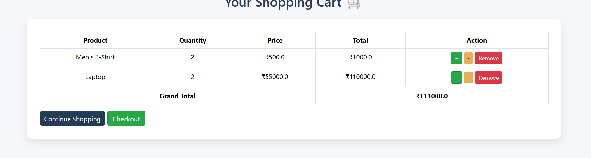

# 🛒 ShopNow - E-commerce Web Application (Django)

A modern and responsive **E-commerce web application** built using **Django, HTML, CSS, and Bootstrap 5**.
This project includes **dynamic product management, add-to-cart functionality, and database integration**.

---

## 🚀 Features

* 🏠 Responsive homepage with carousel
* 🛍️ Dynamic product listing (from database)
* 🛒 Add to Cart (session-based, no JavaScript)
* 📦 Cart page with total calculation
* 🧑‍💼 Admin panel to manage products
* 🖼️ Image upload support (Django media files)
* 🎨 Modern UI with hover effects

---

## 🖥️ Tech Stack

* **Frontend:** HTML, CSS, Bootstrap 5
* **Backend:** Django
* **Database:** SQLite (default Django DB)
* **Templating:** Django Templates

---

## 📸 Screenshots

### 🏠 Homepage


### 🛍️ Products Section


### 🛒 Cart Page



### 📌 Footer


---

## 📂 Project Structure

```id="3x5n2c"
shopnow/
│── media/
│   ├── products/
│── static/
│   ├── images/
│── templates/
│   ├── menu.html
│   ├── index.html
│   ├── cart.html
│── app/
│   ├── models.py
│   ├── views.py
│   ├── urls.py
│── db.sqlite3
│── manage.py
```

---

## ⚙️ Installation & Setup

1. Clone the repository:

```id="z8e2fs"
git clone https://github.com/your-username/shopnow.git
```

2. Navigate to project folder:

```id="zpf9dw"
cd shopnow
```

3. Create virtual environment:

```id="4y9z7b"
python -m venv env
```

4. Activate environment:

```id="d7h4kl"
env\Scripts\activate   (Windows)
```

5. Install dependencies:

```id="fghp21"
pip install django
```

6. Apply migrations:

```id="k2m9pl"
python manage.py makemigrations
python manage.py migrate
```

7. Create superuser:

```id="h8q2sl"
python manage.py createsuperuser
```

8. Run server:

```id="m3v8r1"
python manage.py runserver
```

9. Open in browser:

```id="t8y5nb"
http://127.0.0.1:8000/
```

---

## 🛒 How It Works

* Products are added via **Django Admin Panel**
* Data is stored in the **SQLite database**
* Users can add products to cart
* Cart is managed using **Django sessions**
* Total price is calculated dynamically on cart page

---

## 🎯 Future Improvements

* 🔐 User Authentication (Login/Register)
* 💳 Payment Gateway Integration
* 📦 Order Management System
* ❤️ Wishlist Feature
* 🔍 Search & Filter Products

---

## 🤝 Contributing

Contributions are welcome! Feel free to fork the repository and submit a pull request.

---

## 📧 Contact

* Developer: Akash Pal
* Email: [support@shopnow.com](mailto:support@shopnow.com)

---

## ⭐ Support

If you like this project, give it a ⭐ on GitHub!
